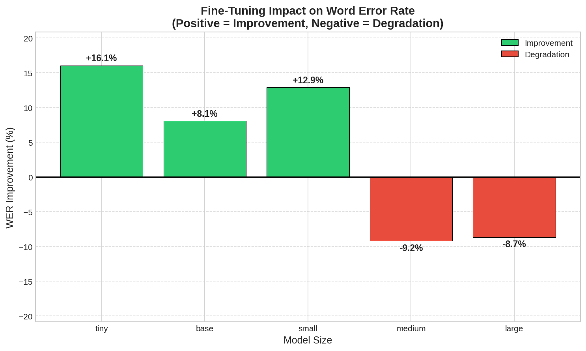
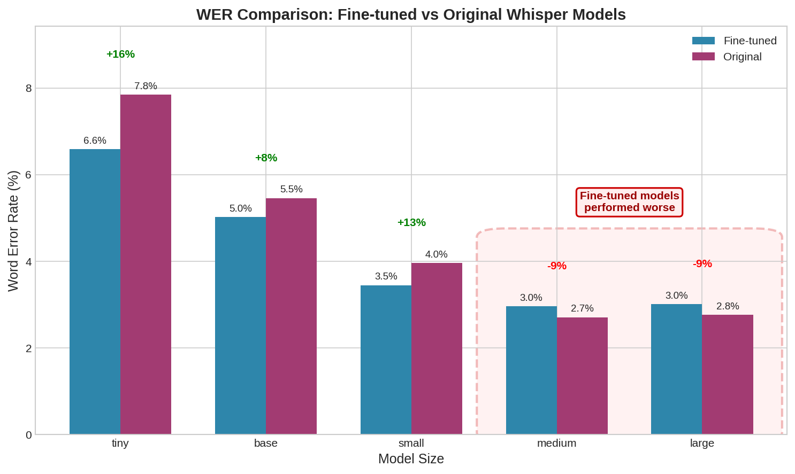
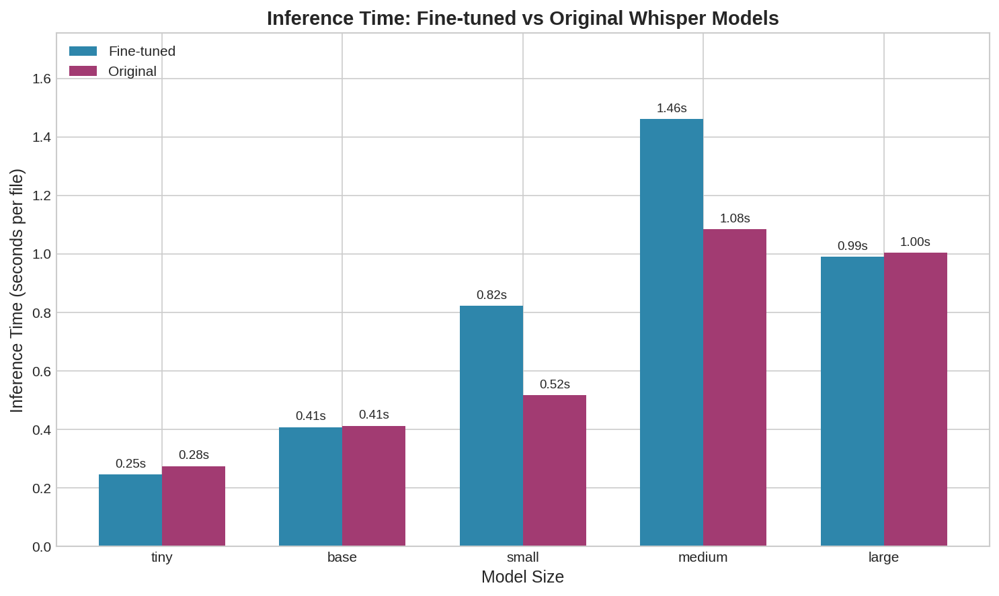
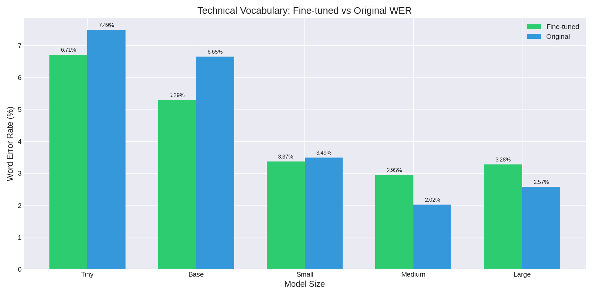
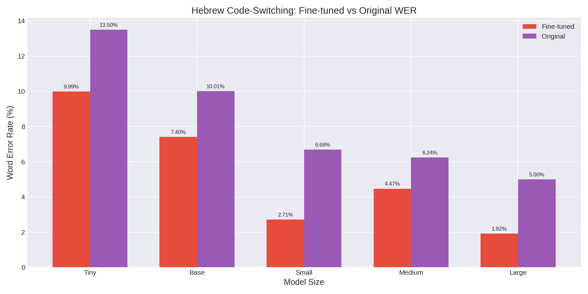
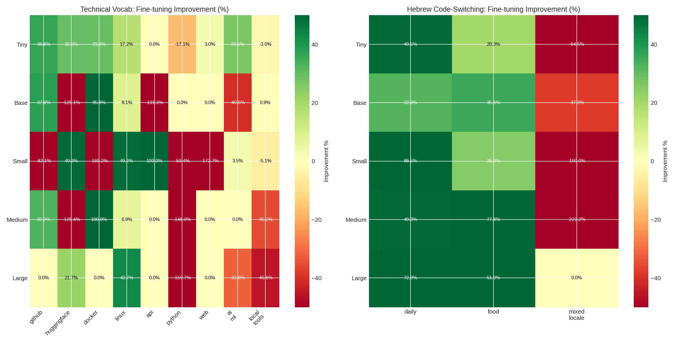

# Does Fine-Tuning Whisper Improve Accuracy?

**TL;DR:** Fine-tuning helps smaller models (tiny, base, small) but hurts larger ones. The exception: **Hebrew code-switching improved across ALL model sizes** (26-62% better).

## Key Actionable Findings

### 1. Choose Your Model Based on Use Case

| If you need... | Use this | Why |
|----------------|----------|-----|
| **Best accuracy** | Original medium | 2.71% WER, no fine-tuning needed |
| **Edge/mobile deployment** | Fine-tuned small | 3.45% WER, good speed/accuracy trade-off |
| **Fastest inference** | Fine-tuned tiny | 0.25s, 16% better than original |
| **Code-switching (multilingual)** | Fine-tune any size | 26-62% improvement across all sizes |

### 2. Fine-Tuning Decision Matrix

| Model Size | Fine-tune? | Result |
|------------|------------|--------|
| tiny | **Yes** | 16% better WER |
| base | **Yes** | 8% better WER |
| small | **Yes** | 13% better WER |
| medium | No | 9% worse WER |
| large | No | 9% worse WER |

### 3. The Hebrew Code-Switching Win

Fine-tuning dramatically improved multilingual content across **all model sizes**:

| Model | Fine-tuned | Original | Improvement |
|-------|------------|----------|-------------|
| tiny | 9.99% | 13.50% | **+26%** |
| base | 7.40% | 10.01% | **+26%** |
| small | 2.71% | 6.69% | **+60%** |
| medium | 4.47% | 6.24% | **+28%** |
| large | 1.92% | 5.00% | **+62%** |

**Takeaway:** If you're transcribing code-switched content or underrepresented languages, fine-tuning is worth it regardless of model size.

---

## Results Overview

### Word Error Rate Comparison

| Model Size | Fine-tuned | Original | Winner |
|------------|------------|----------|--------|
| tiny | 6.59% | 7.85% | Fine-tuned |
| base | 5.02% | 5.46% | Fine-tuned |
| small | 3.45% | 3.96% | Fine-tuned |
| medium | 2.96% | 2.71% | Original |
| large | 3.01% | 2.77% | Original |

### Inference Time (GPU)

| Model Size | Fine-tuned | Original |
|------------|------------|----------|
| tiny | 0.247s | 0.275s |
| base | 0.408s | 0.413s |
| small | 0.823s | 0.518s |
| medium | 1.462s | 1.084s |
| large | 0.991s | 1.004s |

*Note: GPU inference minimizes speed differences. CPU inference may show larger variations.*

---

## Visualizations

### Overall Impact


### WER Comparison


### Inference Time


### Subset Analysis




---

## Technical Vocabulary Breakdown

Fine-tuning helped smaller models but hurt larger ones on tech terms:

| Model | Fine-tuned | Original | Result |
|-------|------------|----------|--------|
| tiny | 6.71% | 7.49% | +10% better |
| base | 5.29% | 6.65% | +20% better |
| small | 3.37% | 3.49% | +4% better |
| medium | 2.95% | 2.02% | -46% worse |
| large | 3.28% | 2.57% | -27% worse |

**Interpretation:** Larger models already have strong tech vocabulary coverage. Fine-tuning on limited data may introduce noise.

---

## Methodology

- **Test set:** 91 audio samples with technical vocabulary (GitHub, Docker, cloud tech) and Hebrew code-switching
- **Normalization:** Whisper Normalizer for fair comparison
- **WER calculation:** [werpy](https://github.com/analyticsinmotion/werpy)
- **Inference:** whisper.cpp with Vulkan GPU acceleration
- **Hardware:** AMD Radeon RX 7700 XT

### Important Context

The fine-tuned models were **proof-of-concept** trained on ~90 minutes of audio. Results may improve with:
- More training data
- Hyperparameter optimization
- Multi-speaker datasets

---

## Resources

**Models:** [danielrosehill/whisper-finetunes](https://huggingface.co/danielrosehill)
**Audio dataset:** [Small-STT-Eval-Audio-Dataset](https://huggingface.co/datasets/danielrosehill/Small-STT-Eval-Audio-Dataset)
**Results dataset:** [STT-Fine-Tune-Eval-101225](https://huggingface.co/datasets/danielrosehill/STT-Fine-Tune-Eval-101225)

## Running the Evaluation

```bash
./scripts/run_gui.sh
```

See [scripts/README.md](scripts/README.md) for tool details.
